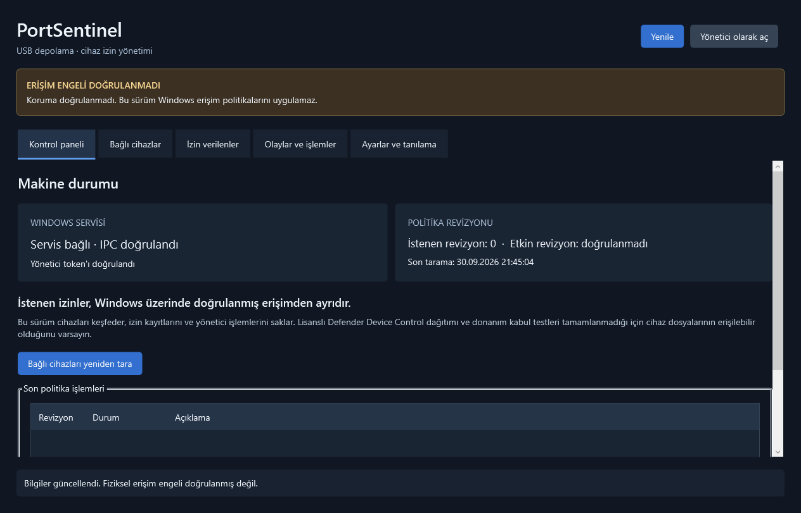
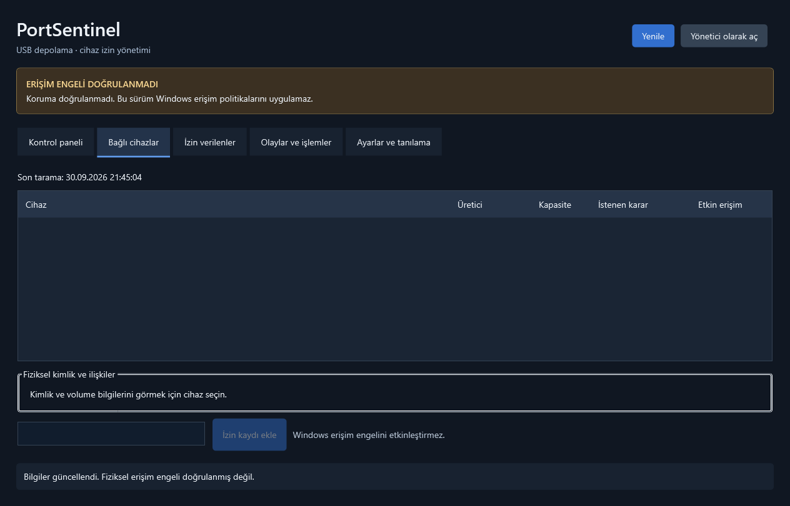
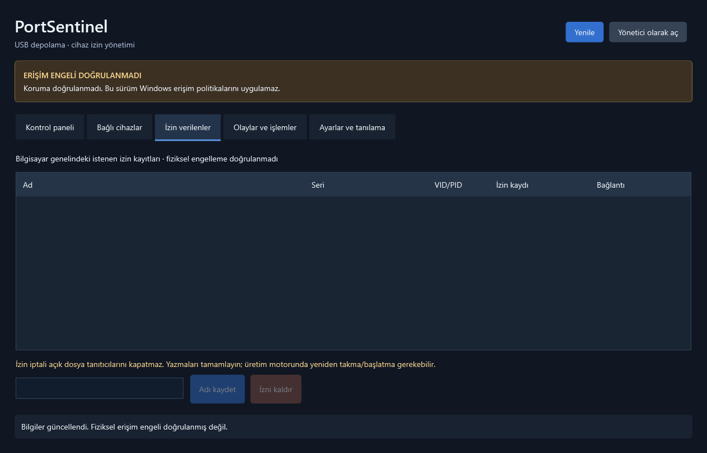
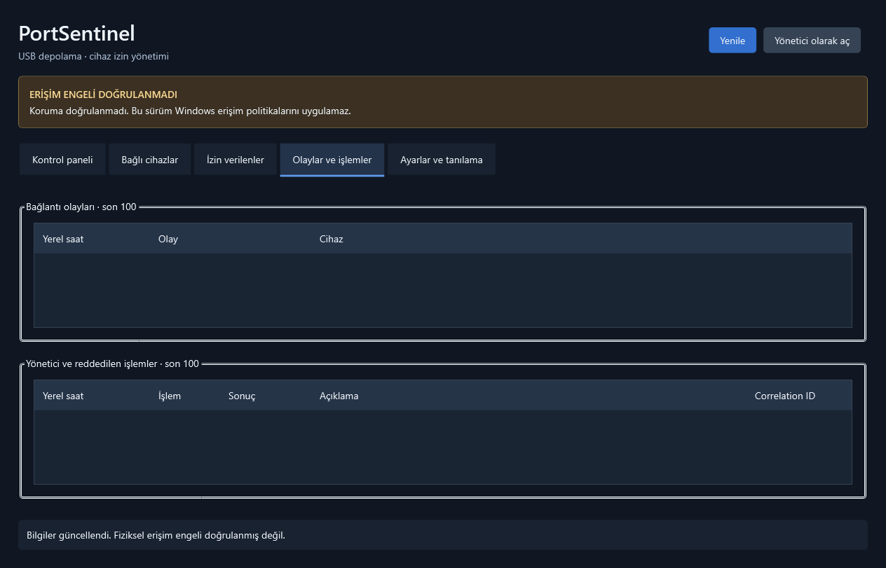
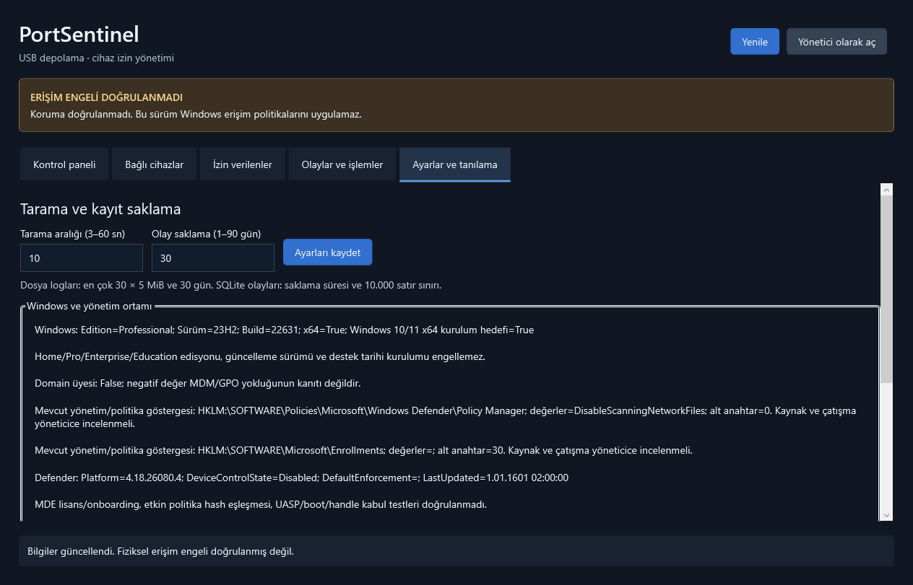
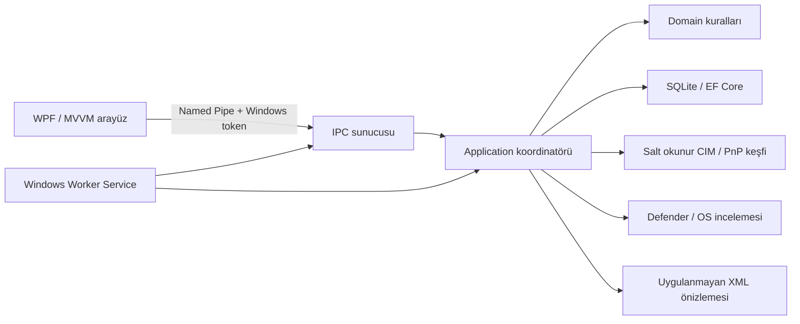

<div align="center">
  
  <h1>PortSentinel</h1>
  <p>Windows için Türkçe USB cihaz izin yönetimi ve keşif uygulaması</p>
  <p><strong>Geliştirici: Yunus İNAN</strong> · Windows 10 / 11 x64 · WPF / .NET 10</p>
  <p>
    <a href="https://github.com/Terabithia1572/PortSentinel/releases/tag/v1.0.1">Setup 1.0.1</a> ·
    <a href="https://github.com/Terabithia1572/PortSentinel/actions/workflows/windows-ci.yml">Windows CI</a> ·
    <a href="docs/SETUP.md">Kurulum belgesi</a> ·
    <a href="docs/TEST-RAPORU.md">Test raporu</a>
  </p>
</div>

> **Mevcut sürüm:** PortSentinel cihazları keşfeder, istenen izin kayıtlarını yönetir ve işlemleri saklar. **Fiziksel USB dosya erişimini engellemez.** Arayüzdeki “Koruma doğrulanmadı” durumu bu sınırı açıkça gösterir. İzin ekleme, iptal veya XML önizlemesi Windows erişim politikasını etkinleştirmez.

## Proje hakkında

PortSentinel, masaüstü arayüzünü arka plan servisinden ayıran bir Windows uygulamasıdır. Türkçe WPF arayüzü kapansa da kurulu Windows servisi çalışabilir; cihaz kayıtlarının, taramanın ve veritabanının sahibi servistir. Arayüz servisle Windows kimliğiyle yetkilendirilmiş Named Pipe üzerinden konuşur.

İstenen izinler SQLite içinde tutulur. Windows üzerinde uygulanmış politika ve doğrulanmış etkin erişim ayrı kavramlardır. Bu sürümde etkin politika revizyonu doğrulanmış değildir. Lisanslı Microsoft Defender Device Control olası üretim motorudur; lisans, dağıtım, readback, çatışma ve fiziksel donanım kabulü tamamlanmayı bekler. Kararın gerekçesi [ADR-001](docs/ADR-001-erisim-denetimi.md) dosyasındadır.

## Özellikler

- Türkçe, koyu temalı **beş WPF ekranı**; async MVVM komutları ve periyodik yenileme.
- Windows CIM/PnP üzerinden **gerçek USB depolama keşfi**; USB fiziksel ata düğümü, seri, VID/PID, disk, bölüm ve volume ilişkileri.
- Cihaz adı, bilgisayar genelinde kalıcı istenen izin kaydı ve izin iptali.
- EF Core migration ve SQLite transaction ile kalıcılık; eski revizyon ve yinelenen kayıtların atomik reddi.
- Yönetici işlemleri ve reddedilen komutlar için audit; bağlantı değişimleri ve correlation ID.
- Standart kullanıcıya görüntüleme; yönetim işlemlerine **gerçek yükseltilmiş Windows yönetici token'ı** kontrolü.
- Named Pipe ACL, mesaj boyutu/şema doğrulaması ve üretimde SCM üzerinden sunucu PID kontrolü.
- Salt okunur Windows/Defender/politika göstergeleri ve uygulanmayan Defender XML önizlemesi.
- **LocalService** hesabıyla çalışan ayrı Windows Worker Service; başlangıç uzlaştırması, tarama, log ve migration.
- .NET çalışma zamanını içeren Türkçe **Inno Setup EXE**, Başlat menüsü ve isteğe bağlı masaüstü kısayolu.
- Kilitli paket restore, Release build, **42 otomatik test** ve Windows GitHub Actions akışı.

## Ekran görüntüleri

Görüntüler gerçek geliştirme servisine bağlı uygulamadan alınmıştır. Tarama sırasında bağlı USB depolama bulunmadığından listeler boştur; örnek cihaz sonucu üretilmemiştir.



<details>
<summary>Diğer dört ekranı göster</summary>

**Bağlı cihazlar** — fiziksel kimlik, kapasite, ilişkiler ve istenen/etkin durum.



**İzin verilenler** — kalıcı cihaz kayıtları, ad değiştirme ve izin iptali.



**Olaylar ve işlemler** — bağlantı olayları ve yönetim sonuçları.



**Ayarlar ve tanılama** — tarama, kayıt saklama ve salt okunur Windows durumu.



</details>

## İndirme ve kurulum

1. [v1.0.1 Releases sayfasından](https://github.com/Terabithia1572/PortSentinel/releases/tag/v1.0.1) `PortSentinel-Setup-1.0.1.exe` dosyasını indirin.
2. İsterseniz aynı sayfadaki `.sha256` dosyasıyla bütünlüğü doğrulayın.
3. Setup'ı çalıştırıp UAC yönetici isteğini onaylayın; masaüstü kısayolu isteğe bağlıdır.
4. PortSentinel'i Başlat menüsünden açın. Standart kullanıcı görüntüleyebilir; izin/ayar işlemleri için arayüzde **Yönetici olarak aç** düğmesini kullanın.

**Hedef:** Windows 10 ve Windows 11 **x64**. Home, Pro, Enterprise ve Education edisyonu; 23H2/24H2/25H2 güncelleme adı veya işletim sistemi destek tarihi üzerinden kurulum engeli yoktur. 32 bit ve ARM64 için ayrı paket üretilmemiştir. Windows 10 üzerinde ayrı çalıştırma/kabul testi henüz yapılmadı; [doğrulanan kapsam](docs/DESTEK.md) ayrıca belirtilmiştir.

Setup **.NET 10.0.12 x64 çalışma zamanını içerir**; kullanıcı ayrıca .NET kurmaz. Geliştirici bilgisi **Yunus İNAN**, GitHub hesabı **Terabithia1572** olarak korunur. EXE kod imzalı değildir.

Dosya bütünlüğünü PowerShell ile kontrol etmek için iki dosyayı aynı dizine indirin:

```powershell
$expected = ((Get-Content .\PortSentinel-Setup-1.0.1.sha256 -Raw).Trim() -split '\s+')[0]
$actual = (Get-FileHash .\PortSentinel-Setup-1.0.1.exe -Algorithm SHA256).Hash
if ($actual -ine $expected) { throw 'SHA256 uyuşmuyor.' }
'Bütünlük doğrulandı.'
```

Kurulum yolları:

- İkililer: `C:\Program Files\PortSentinel\service` ve `desktop`.
- Servis adı: `PortSentinel`; hesap: `NT AUTHORITY\LocalService`; başlangıç: gecikmeli otomatik.
- Veri: `C:\ProgramData\PortSentinel`.
- Veritabanı: `portsentinel.db`; audit ve istenen kayıtlar bu veritabanındadır.
- Servis günlükleri: `C:\ProgramData\PortSentinel\logs`.
- Kurulum sahipliği: `install-receipt.json`; salt okunur politika başlangıcı: `policy-baseline.json`.

Kurucu mevcut servis veya sahipliği belirsiz kurulum dizinini ezmez. Dosya hash'leri ve reparse kontrolleri yapılır. Program Files ve ProgramData ACL'leri açıkça düzenlenir. Servis kayıt/başlatma hatası başarılı kurulum olarak gösterilmez. **USBSTOR, Defender, GPO ve MDM erişim politikaları değiştirilmez.** Ayrıntılı süreç [SETUP.md](docs/SETUP.md) içindedir.

### Kaldırma ve güncelleme

Windows **Ayarlar → Uygulamalar → PortSentinel → Kaldır** yolunu veya Başlat menüsündeki kaldırıcıyı kullanın. Servis yolu, sahiplik ve dosya hash kontrollerinden sonra servis durdurulur, kaydı ve kurulan dosyalar kaldırılır. **ProgramData veritabanı, ayarlar, audit ve başlangıç kaydı korunur.**

Yerinde yükseltme bu sürümde yoktur: servisi durdurup korumalı veriyi yedekleyin, eski sürümü kendi kaldırıcısıyla kaldırın ve yeni setup'ı kurun. ZIP/PowerShell kurulumu kendi betikleriyle yönetilir; Inno kurulumunda Windows kaldırıcı kullanılır. [Kurtarma belgesi](docs/KURTARMA.md).

## Kaynaktan geliştirme

Gerekenler: Windows x64, `global.json` içinde sabitlenen **.NET SDK 10.0.401** ve Git. Visual Studio zorunlu değildir. Setup üretmek için ayrıca **Inno Setup 6** gerekir.

```powershell
git clone https://github.com/Terabithia1572/PortSentinel.git
cd PortSentinel
dotnet restore PortSentinel.sln --locked-mode
dotnet build PortSentinel.sln -c Release --no-restore
dotnet test PortSentinel.sln -c Release --no-build --no-restore
```

İki ayrı PowerShell terminalinde geliştirme servisini ve masaüstünü açın:

```powershell
# Terminal 1: console servisi; Ctrl+C ile durdurulur.
.\scripts\Run-Development.ps1
```

```powershell
# Terminal 2: WPF arayüzü.
.\scripts\Run-Development.ps1 -Desktop
```

Geliştirme verisi proje altındaki `artifacts/development` dizinindedir. Geliştirme pipe'ı `PortSentinel.Development.v1`; üretim pipe'ı `PortSentinel.v1`. Geliştirme istemcisi SCM sunucu kontrolünü atlar; gerçek Windows token yetkilendirmesi devam eder. Yönetim işlemleri geliştirmede de yükseltilmiş yönetici token'ı gerektirir.

### Paket üretimi

```powershell
# Restore + Release build + tüm testler + framework-dependent publish:
.\scripts\Build.ps1

# Restore + Release build + tüm testler + self-contained Inno Setup EXE:
.\scripts\Build-Setup.ps1
```

`Build.ps1`: `artifacts/publish/service`, `desktop`, belgeler, lisans metadata ve `checksums.json`. Bu paketi çalıştırmak için .NET 10 x64 Desktop Runtime gerekir.

`Build-Setup.ps1`: `artifacts/setup-payload` ve `artifacts/installer/PortSentinel-Setup-1.0.1.exe` / `.sha256`. Çalışma zamanı pakettedir. `-InnoCompiler 'C:\...\ISCC.exe'` özel derleyici yolunu seçer. `-SkipTests` yalnız testler zaten doğrulandığında kullanılmalıdır. Build betikleri **kurulum yapmaz**.

Sürüm/yayıncı `Directory.Build.props`, doğrudan paket sürümleri `Directory.Packages.props`, çözülen bağımlılıklar `packages.lock.json` dosyalarındadır. NuGet kaynağı `NuGet.Config` içinde tanımlıdır.

## Mimari



- **Domain:** fiziksel kimlik, kapsam ve erişim değerlendirmesi; EF/WPF/Windows bağımlılığı yoktur.
- **Contracts:** IPC operation, DTO ve framing; uygulama kimliğini istemci verisi belirlemez.
- **Application:** FluentValidation, kullanım senaryoları, yetkilendirme, correlation ID, revizyon ve koordinasyon.
- **Infrastructure:** SQLite, EF migration, salt okunur Windows adaptörleri, Named Pipe, SCM eşleştirmesi ve korumalı depolama kontrolü.
- **Service:** DI, Windows Service yaşam döngüsü, migration, tarama ve dönen JSON logları.
- **Desktop:** WPF/MVVM; veritabanı ve cihaz kontrolüne doğrudan erişmez, IPC istemcisini kullanır.

İstenen cihaz/rule/audit kaydı ve `Pending` revizyon tek transaction'da oluşur. Eski `ExpectedRevision` conflict üretir. Bu sürümün backend sonucu `Unverified` olduğundan `EffectiveRevision` ve `VerifiedUtc` boş kalır. Yarım kalan `Pending` kayıtlar başlangıçta `Interrupted` olur. Backend başarısızlığı istenen kaydı geri alınmış gibi göstermez. [Ayrıntılı mimari](docs/MIMARI.md).

### Kimlik ve yetkilendirme

Pipe sunucusu Windows token'ını impersonation ile okur; istemcinin `admin=true` gibi bir alan göndermesi kabul edilmez. Standart kullanıcı snapshot görebilir; Grant, Revoke, Rename, Settings, Reconcile ve PreviewPolicy yönetici gerektirir. Üretim istemcisi pipe sunucu PID'sini Running durumundaki kayıtlı Windows servisiyle eşleştirir.

IPC: dört byte little-endian uzunluk ve UTF-8 JSON; sürüm 1, en fazla 64 KiB istek ve 1 MiB yanıt, JSON derinliği 32. Bilinmeyen alan/enum, eksik frame ve geçersiz boyut reddedilir. Timeout ve cancellation vardır. [IPC protokolü](docs/IPC.md).

Fiziksel USB ata düğümü, seri, VID/PID ve UniqueID yeteneği birlikte değerlendirilir. Etiket, cihaz adı veya sürücü harfi tek başına kimlik kabul edilmez. Serisiz, belirsiz/çakışan, sistem/boot diski veya kapsam dışı cihaz için izin uygunluğu reddedilebilir. Bu kimlikler kriptografik değildir; firmware ile taklit edilebilir.

## Testler ve CI

Son yerel doğrulama: **24 unit + 18 integration = 42 başarılı test**, 0 atlanan/başarısız; Release build 0 hata/uyarı. Gerçek geliştirme servisiyle **beş WPF ekranı** render edildi ve binding hata logu boştu. Self-contained EXE'ler ayrıca çalıştırıldı. Windows 11 Pro 23H2/build 22631, yeni kurulum ön kontrolünden geçti.

- Unit: kimlik/kapsam, on cihazın bağımsız değerlendirmesi, XML önizleme, doğrulama ve IPC framing.
- SQLite/Application: gerçek geçici SQLite, migration, kalıcılık, conflict, duplicate, eşzamanlı işlemler, auth, retention ve hata/başlangıç uzlaştırması.
- WindowsIpc: gerçek Named Pipe/ACL/token; deny-only yönetici SID'li kısıtlı token'ın mutasyonunun reddi; sahte admin alanı.
- WindowsReadOnly: gerçek CIM/PnP ve Windows/Defender tanılaması.

```powershell
dotnet test PortSentinel.sln -c Release
dotnet test tests/PortSentinel.IntegrationTests -c Release --filter 'Category=WindowsIpc'
dotnet test tests/PortSentinel.IntegrationTests -c Release --filter 'Category=WindowsReadOnly'
```

[Windows CI](.github/workflows/windows-ci.yml), main push/PR ve sürüm tag'lerinde Windows runner üzerinde restore/build/test/publish çalıştırır. TRX ve framework-dependent paket artifact olarak saklanır. Sürüm tag'i veya manuel `build_installer` seçeneği self-contained kurucuyu da üretir. Action commit'leri sabitlenmiştir. CI uygulamayı kurmaz, USB politikası etkinleştirmez ve fiziksel donanım kabulü sayılmaz. [Test raporu](docs/TEST-RAPORU.md).

## Veri, kayıtlar ve tanılama

SQLite'ın tek sahibi servistir; bir sahiplik kilidi aynı DB üzerinde ikinci servis sürecini reddeder. ProgramData yazma yetkisi SYSTEM, Administrators ve LocalService ile sınırlandırılır. Reparse point veya geniş yazma ACL'si korumalı depolama kontrolünde reddedilir.

Zamanlar UTC saklanıp arayüzde yerel saat gösterilir. Tarama aralığı 3–60 saniye; olay saklama 1–90 gün. JSON logları en fazla 30 × 5 MiB / 30 gün; olay/audit tabloları saklama süresi ve 10.000 satır sınırıyla yönetilir. SQLite fiziksel dosya küçültme otomatik değildir.

Bağlantı hatasında yönetim komutları kapatılır; son bilinen liste güncel kabul edilmez. Envanter hatası önceki gözlemleri silmez, fakat yeni grant için başarılı yeni tarama gerekir. Sorun incelerken önce `Get-Service PortSentinel`, servis logları ve arayüz tanılamasını kontrol edin. DB yedeklemesinde servisi durdurup DB ve varsa WAL/SHM dosyalarını korumalı konuma birlikte kopyalayın.

## Bilinen sınırlar ve yol haritası

Bu sürümde USB dosya erişimi engelleme yoktur. Açık handle/yazma iptali, boot öncesi engelleme, servis duruşunda koruma ve politika engine readback kabul edilmemiştir. Polling kısa bağlantıları kaçırabilir. Mount-point-only volume ayrıntıları tam çıkarılmaz. Lisans/onboarding, kesin GPO/MDM kaynak çözümleme ve Windows 10/gerçek SCM kabulü bekler.

Üretim erişim denetimi için sıradaki işler: lisanslı backend entegrasyonu, politika sahipliği ve geri alma protokolü, etkin hash/revizyon doğrulaması, USBSTOR/UASP/boot/handle donanım testleri, farklı Windows edisyonları ve standart kullanıcıyla kurulum kabulü, kod imzalama ve sürüm yükseltme akışı. Bunlar tamamlanmış özellikler olarak sunulmaz.

Donanım protokolü [DONANIM-KABUL.md](docs/DONANIM-KABUL.md) içindedir. `scripts/Test-Hardware.ps1`, açıkça seçilen fixture dosyalarında tek salt okunur deneme yapar; boot/raw/write/handle garantisi vermez ve kendi başına Windows politikası değiştirmez.

## Depo düzeni ve belgeler

```text
src/
  PortSentinel.Domain/          Saf kurallar ve kayıt modelleri
  PortSentinel.Contracts/       IPC DTO / framing
  PortSentinel.Application/     Kullanım senaryoları ve koordinatör
  PortSentinel.Infrastructure/  Windows, IPC, SQLite, migration
  PortSentinel.Service/         Windows Worker Service
  PortSentinel.Desktop/         Türkçe WPF/MVVM
 tests/                        Unit ve integration testleri
 scripts/                      Build, kurulum, kaldırma, geliştirme
 installer/                    Inno Setup kaynakları ve simge
 docs/                         Ayrıntılı belgeler ve ekran görüntüleri
 .github/                      Windows CI ve issue/PR şablonları
```

- [Kurulum ve paket üretimi](docs/SETUP.md)
- [Windows uyumluluğu](docs/DESTEK.md)
- [Mimari ve işlem tutarlılığı](docs/MIMARI.md)
- [IPC protokolü](docs/IPC.md)
- [Backend kararı](docs/ADR-001-erisim-denetimi.md)
- [Test raporu](docs/TEST-RAPORU.md) ve [donanım kabulü](docs/DONANIM-KABUL.md)
- [Kurtarma / kaldırma](docs/KURTARMA.md)
- [Bağımlılıklar](docs/BAGIMLILIKLAR.md)
- [Değişiklik günlüğü](CHANGELOG.md), [katkı](CONTRIBUTING.md), [güvenlik](SECURITY.md)

`artifacts`, `bin`, `obj`, yerel veritabanları ve loglar kaynak depoya dahil edilmez. Setup ve hash dosyaları **GitHub Releases** üzerinden dağıtılır.

## Geliştirici ve telif

**Yunus İNAN** — [Terabithia1572](https://github.com/Terabithia1572).

Copyright © 2026 Yunus İNAN. **Tüm hakları saklıdır.** PortSentinel için ayrıca bir açık kaynak lisansı verilmemiştir; kullanım ve yeniden dağıtım izinleri için geliştiriciyle iletişime geçin. Üçüncü taraf paketlerin kendi lisansları vardır. [Telif / üçüncü taraf bildirimi](NOTICE.md).
